# Deterministic Heater Controller

| Property          | Value                                          |
|-------------------|------------------------------------------------|
| Project ID        | tj01 (Previously JBT01)                        |
| Started           | 14th February 2023                             |
| Stack             | C, Keil uVision, KiCAD 6.0.0, Nuvoton MCUs     |
| Keywords          | MS51FB9AE, MAX6675, K-Type Thermocouple, T91-30A, <br>110/230V AC to 12V DC SMPS, LCD Display, Timer 2 |

## 🚀 Overview

A heater controller project built around the Nuvoton MS51FB9AE. It delivers deterministic operation, safety auto-cutoff, preset timer modes, and temperature measurement using a 750°C K-type thermocouple.

The custom PCB includes a 16×2 LCD, MAX6675 thermocouple interface, few switches, and a relay for heater control. The design prioritizes temperature safety and reliable performance in a demanding environment.

## ✍️ Requirement

This device is intended for a medical/sanitary incinerator where the internal chamber exceeds 750°C. The electronics were designed to operate reliably under harsh conditions and maintain stable performance for at least two years.

The initial order was for 100 units, with 6 controller boards to be delivered within 90 days.

Scope included requirements gathering, controller design, PCB and firmware development, mechanical integration support, and field testing to validate reliability.

## 🧩 Project Highlights

- Designed and developed the complete system from scratch, including requirements, hardware, firmware, testing, and delivery.
- Initially targeted STM8/STM32, then switched to MS51FB9AE because of availability and cost advantages.
- Iteratively improved the design based on feedback and testing, including PCB layout, component selection, and feature updates.
- Used mechanical and PCB co-design to ensure the controller fit the enclosure, was serviceable, and handled thermal isolation and airflow.

- **Firmware Highlights:**
  - Implemented a state machine to manage operating modes and ensure deterministic behavior.
  - Ported and customized a 16x2 LCD library for the MS51FB9AE with modular pin mapping.
  - Implemented MAX6675 thermocouple support for accurate temperature monitoring and safety control.
  - Added timer modes with automatic cutoff to prevent overheating.
  - Used a superloop architecture to keep the system responsive while managing timer interrupts and state transitions.

## 🔄 Revisions

- **JBT01A** - Initial design and prototype with basic functionality.
- **JBT01B** - Added filtering capacitor and improved PCB layout for better noise immunity.
- **JBT01C** - Added removable LCD headers and improved accessibility and mounting **([Demo Video](https://youtu.be/qEdxYMNRhFU?si=CgpE43CbFfmUwAwB))**.

## 📚 Controller Board Design

<p align="center">
  <table>
    <tr>
      <td align="center"><strong>Top</strong><br>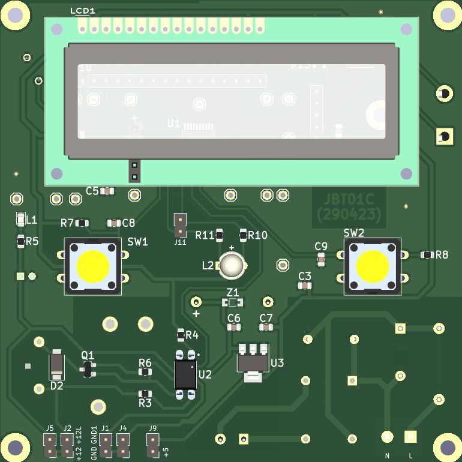</td>
      <td align="center"><strong>Bottom</strong><br>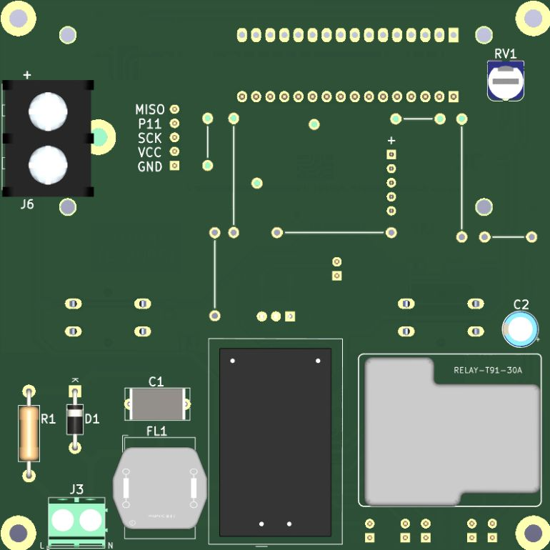</td>
    </tr>
  </table>
</p>

## 🗂️ Repo Structure

```bash
├───Firmware
│   ├───Keil Project
│   └───Source Files
│
└───Hardware
    ├───3D
    ├───BOM
    ├───Gerbers
    ├───Images
    └───Source Files
```

## VS Code Extensions

```bash
cl.keil-assistant
streetsidesoftware.code-spell-checker
```

## 🏗️ Mechanical & Hardware Co-Design

The device was developed through integrated mechanical and electronics design to ensure reliable operation in an incinerator environment. Mechanical requirements included enclosure space, thermal isolation, airflow, mounting, serviceability, and cable routing. Hardware requirements such as sensor interfaces, relay isolation, display visibility, and maintenance access shaped the enclosure and system layout.

## 🔧 Proof of Work

<div align="center" style="display:flex; flex-wrap:wrap; justify-content:center; gap:1rem;">
  <div style="width:30%; min-width:220px; text-align:center;">
    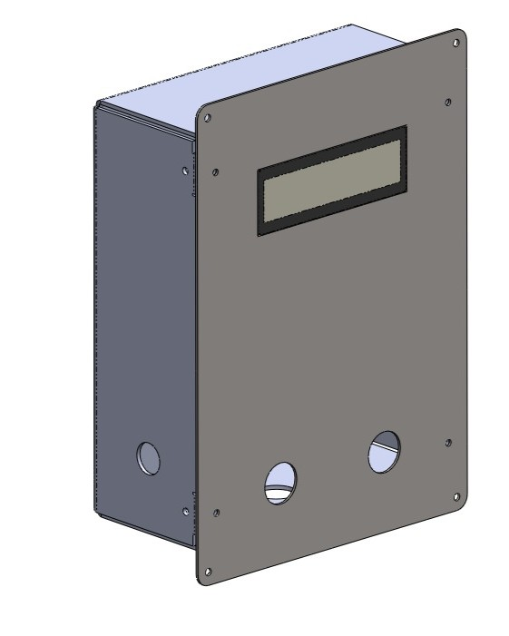
    <p style="margin:0.25rem 0 0;">Enclosure design</p>
  </div>
  <div style="width:30%; min-width:220px; text-align:center;">
    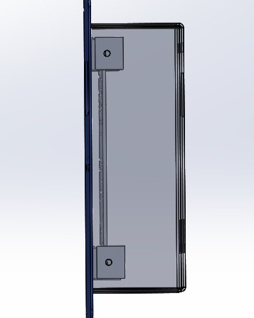
    <p style="margin:0.25rem 0 0;">Enclosure design, Side view</p>
  </div>
  <div style="width:30%; min-width:220px; text-align:center;">
    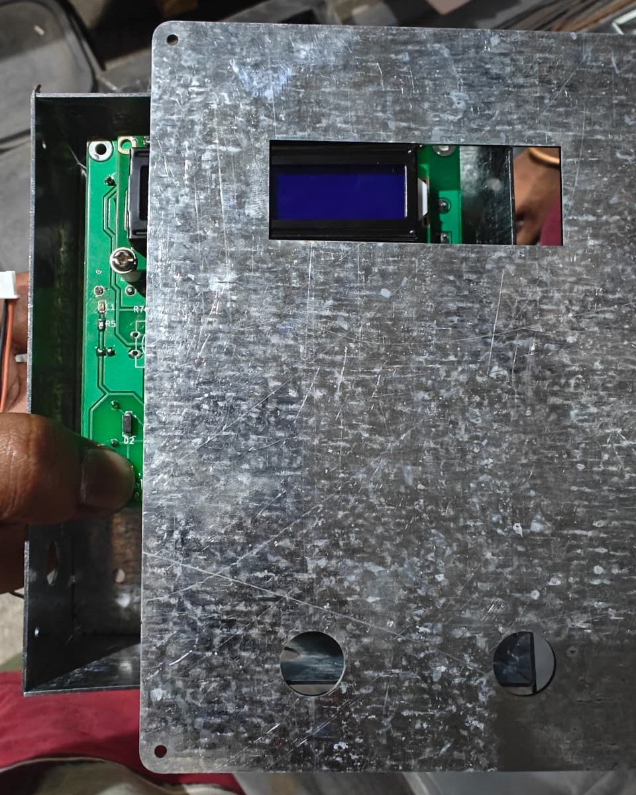
    <p style="margin:0.25rem 0 0;">Enclosure prototype, Front view</p>
  </div>
  <div style="width:30%; min-width:220px; text-align:center;">
    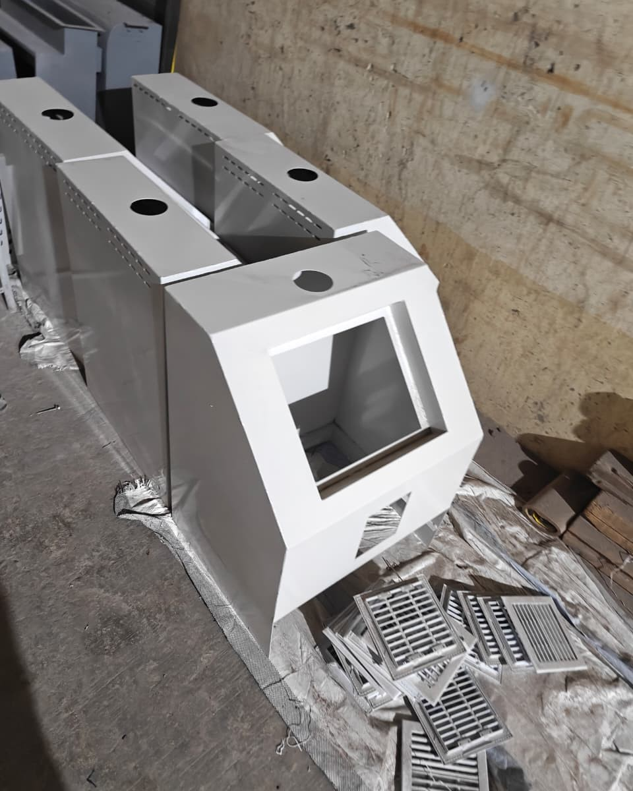
    <p style="margin:0.25rem 0 0;">Mechanical parts before assembly</p>
  </div>
  <div style="width:30%; min-width:220px; text-align:center;">
    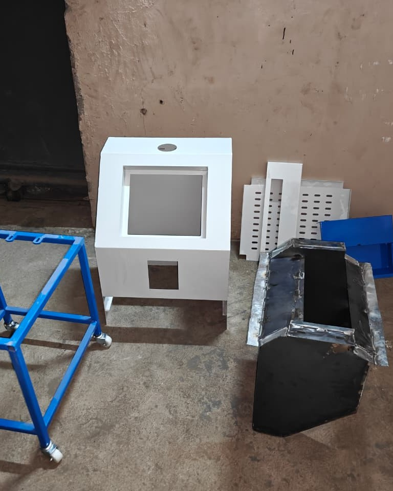
    <p style="margin:0.25rem 0 0;">Mechanical parts before assembly</p>
  </div>
  <div style="width:30%; min-width:220px; text-align:center;">
    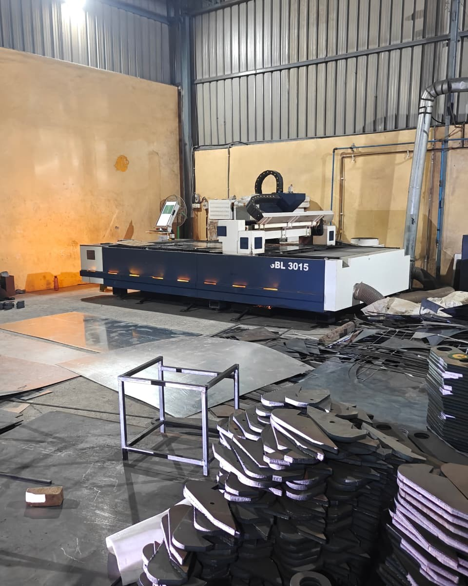
    <p style="margin:0.25rem 0 0;">Laser cut machine setup</p>
  </div>
  <div style="width:30%; min-width:220px; text-align:center;">
    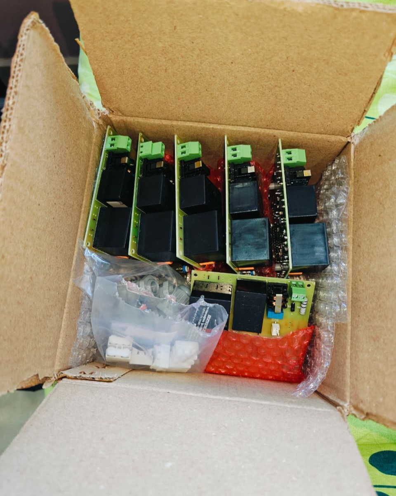
    <p style="margin:0.25rem 0 0;">Tested controllers before delivery</p>
  </div>
  <div style="width:30%; min-width:220px; text-align:center;">
    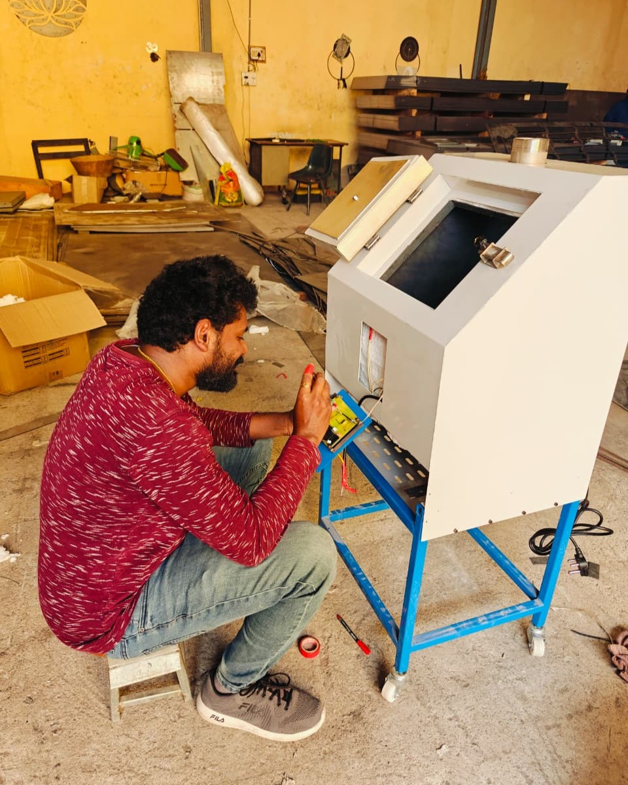
    <p style="margin:0.25rem 0 0;">Inspecting, fixing, and verifying electrical connections</p>
  </div>
  <div style="width:30%; min-width:220px; text-align:center;">
    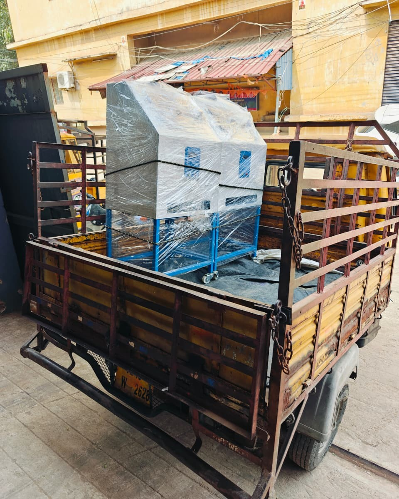
    <p style="margin:0.25rem 0 0;">Tested and ready to be dispatched</p>
  </div>
  <div style="width:30%; min-width:220px; text-align:center;">
    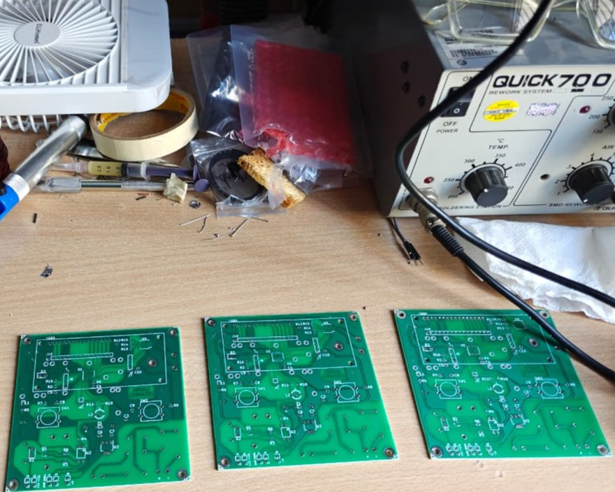
    <p style="margin:0.25rem 0 0;">PCBs before assembly</p>
  </div>
  <div style="width:30%; min-width:220px; text-align:center;">
    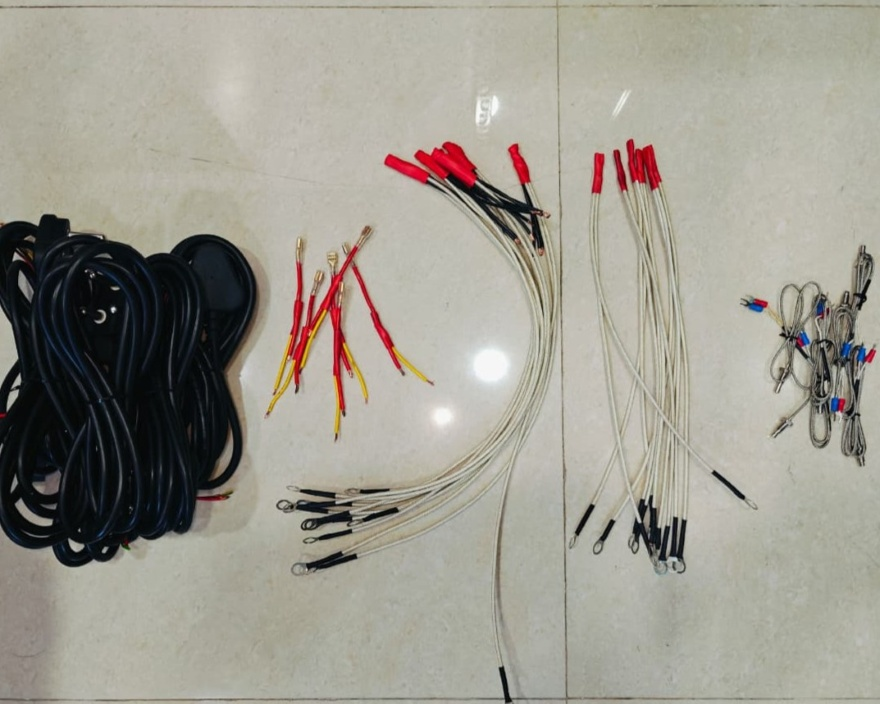
    <p style="margin:0.25rem 0 0;">Cables and connectors</p>
  </div>
  <div style="width:30%; min-width:220px; text-align:center;">
    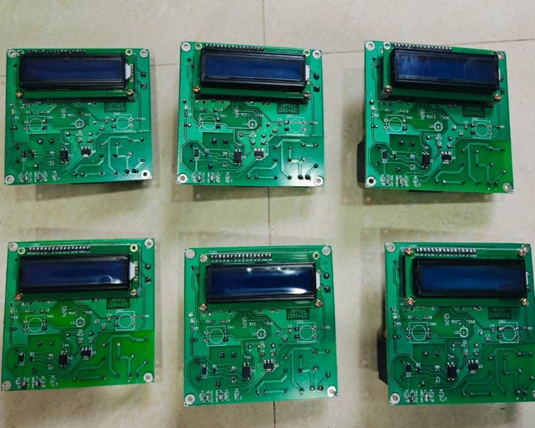
    <p style="margin:0.25rem 0 0;">PCBs after assembly, Front view</p>
  </div>
</div>

### 🛠️ Video Demos

<div align="center" style="display:flex; flex-wrap:wrap; justify-content:center; gap:1rem;">
  <div style="width:30%; min-width:220px; text-align:center;">
    <video
      src="Hardware/Images/Batch-Rev-C.mp4" style="width:100%; height:auto;"
      controls
      controlsList="nodownload"
      muted
      playsinline>
    </video>
    <p style="margin:0.25rem 0 0;">Controllers</p>
  </div>
  <div style="width:30%; min-width:220px; text-align:center;">
    <video
      src="Hardware/Images/Prototype-Test1.mp4" style="width:100%; height:auto;"
      controls
      controlsList="nodownload"
      muted
      playsinline>
    </video>
    <p style="margin:0.25rem 0 0;">Test cycle</p>
  </div>
  <div style="width:30%; min-width:220px; text-align:center;">
    <video
      src="Hardware/Images/Prototype-Test2.mp4" style="width:100%; height:auto;"
      controls
      controlsList="nodownload"
      muted
      playsinline>
    </video>
    <p style="margin:0.25rem 0 0;">Test cycle</p>
  </div>
</div>

## ✏️ Conclusion & Current Status

The project requirements were successfully met and delivered within the specified timeline, with 20 controller units delivered and deployed in the field. Although an initial requirement of 100 units was anticipated, the full order was not fulfilled by the client. However, the delivered controllers have been operating reliably, meeting the requirement of stable performance for at least two years. The project has been a valuable learning experience in embedded system design, hardware-software co-design, and project management.

**Of the controller boards delivered, all except one remain functional and in good operating condition after nearly two years of field deployment**. The single failure was due to a surge in the power supply, which bricked the SMPS unit.

Following the first year of operation, scheduled maintenance was provided from our side. At the time of this writing, all deployed machines continue to operate successfully, demonstrating reliability under real-world operating conditions.

## 🏷️ Misc: Repository Naming Convention

Before I started naming projects in a sequence, I had worked on many projects. When I went back to reuse content or refer to specific details, I usually struggled to find them or had already lost track of them.

Over time, I decided to standardize the naming with “TJ” and continue using it consistently, grouping and organizing both old and new projects into a structured sequence.

Not all projects can be shared publicly because of client restrictions or ownership agreements. As a result, the sequence may have gaps where some projects are not listed or documented. However, I maintain a private record of all projects for my reference and learning.
